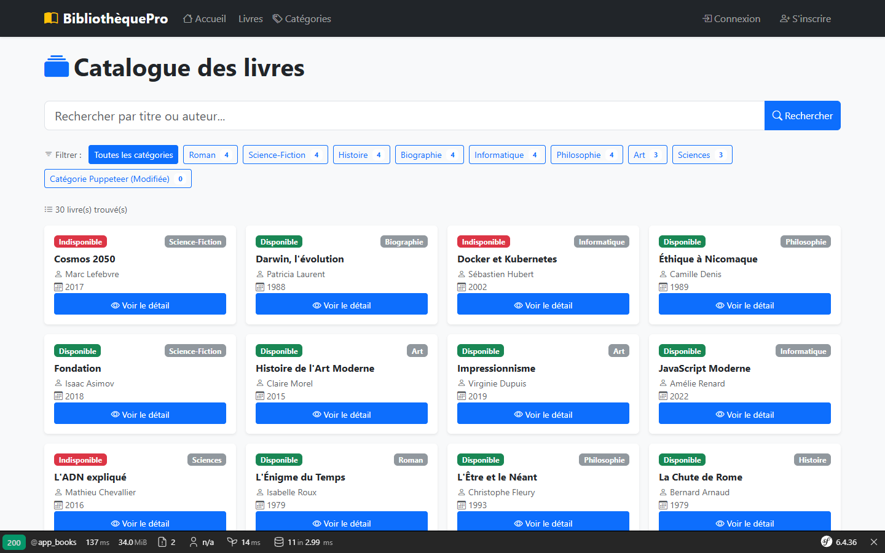
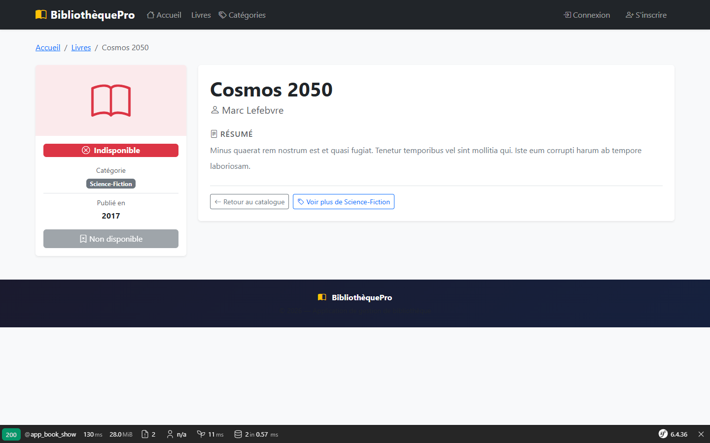
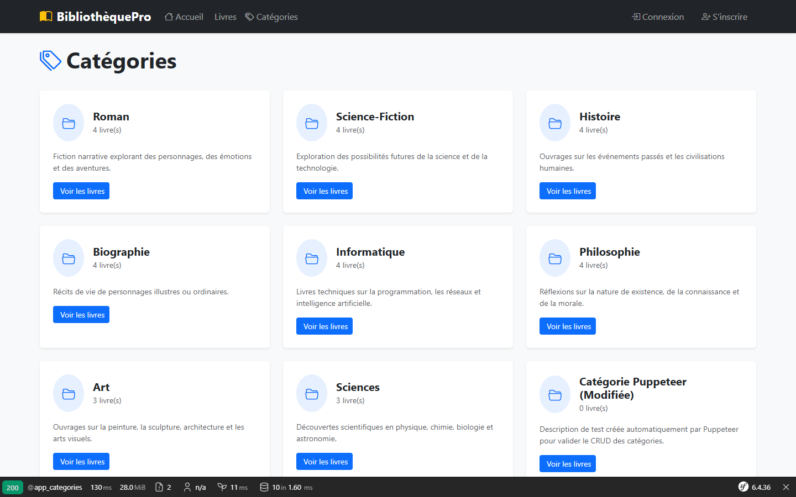
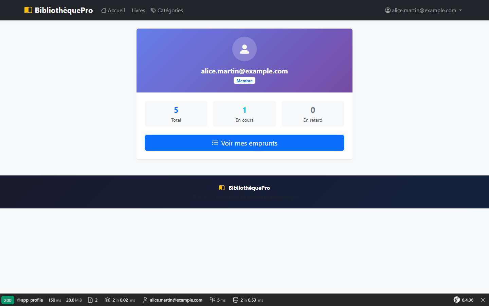
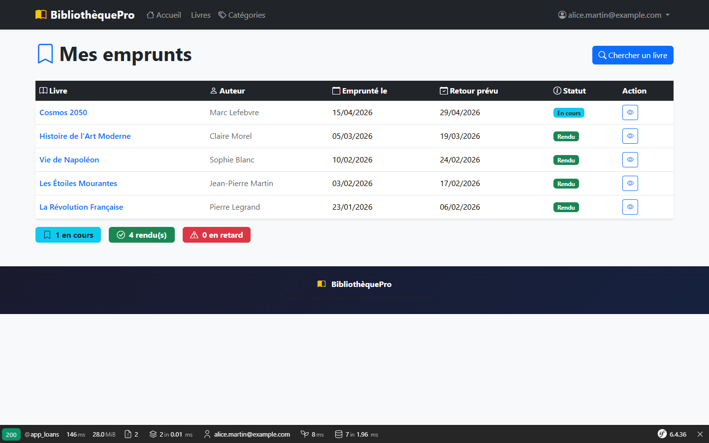
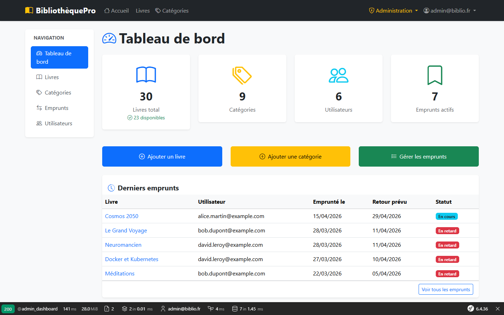
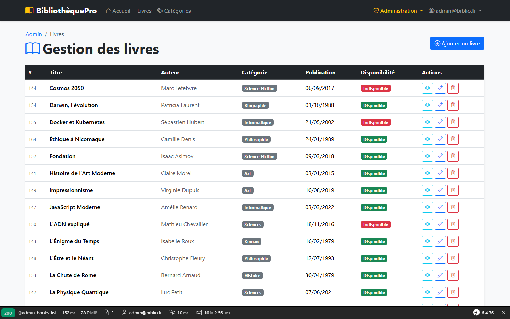

# BibliothèquePro — Application de gestion de bibliothèque

Application web de gestion d'une bibliothèque de prêt, développée avec **Symfony 6.4**.

---

## Fonctionnalités

### Partie publique
- Page d'accueil avec les dernières acquisitions
- Catalogue de livres avec recherche par titre/auteur
- Filtre par catégorie
- Page de détail d'un livre
- Listing des catégories

### Espace utilisateur
- Inscription et connexion
- Consultation du profil
- Emprunt de livres disponibles (durée : 14 jours)
- Suivi de ses emprunts (en cours, rendu, en retard)

### Espace administrateur
- Tableau de bord avec statistiques
- CRUD complet des livres
- CRUD complet des catégories
- Liste des utilisateurs
- Gestion des emprunts (modification du statut)

---

## Installation

### Prérequis
- PHP 8.2+ (XAMPP recommandé)
- MySQL 8.0+
- Composer

### Étapes

1. **Récupérer les sources du projet**
   ```bash
   cd Projet_Spe
   ```

2. **Installer les dépendances**
   ```bash
   composer install
   ```

3. **Configurer la base de données**
   
   Copier `.env` et adapter l'URL :
   ```bash
   cp .env .env.local
   ```
   Modifier dans `.env.local` :
   ```
   DATABASE_URL="mysql://root:@127.0.0.1:3306/projet_spe_biblio?serverVersion=8.0&charset=utf8mb4"
   ```

4. **Créer la base de données et appliquer les migrations**
   ```bash
   php bin/console doctrine:database:create
   php bin/console doctrine:migrations:migrate
   ```

5. **Charger les données de test (fixtures)**
   ```bash
   php bin/console doctrine:fixtures:load
   ```

6. **Lancer le serveur**
   
   Avec XAMPP : démarrer Apache et accéder à `http://localhost/Projet_Spe/public/`
   
   Ou avec le serveur PHP intégré :
   ```bash
   php -S localhost:8000 -t public/
   ```

---

## Comptes de démonstration

| Rôle | Email | Mot de passe |
|------|-------|-------------|
| **Administrateur** | admin@biblio.fr | admin123 |
| Utilisateur | alice.martin@example.com | user123 |
| Utilisateur | bob.dupont@example.com | user123 |
| Utilisateur | claire.petit@example.com | user123 |
| Utilisateur | david.leroy@example.com | user123 |
| Utilisateur | emma.bernard@example.com | user123 |

---

## Structure technique

### Entités
| Entité | Description |
|--------|-------------|
| `Book` | Livre avec titre, auteur, résumé, date de publication, disponibilité |
| `Category` | Catégorie de livre (nom, description) |
| `User` | Utilisateur avec email, rôles, mot de passe hashé |
| `Loan` | Emprunt liant un utilisateur à un livre avec dates et statut |

### Relations
- `Book` ManyToOne → `Category`
- `User` OneToMany → `Loan`
- `Loan` ManyToOne → `User`
- `Loan` ManyToOne → `Book`

### Validations implémentées
- Titre du livre : obligatoire (NotBlank)
- Résumé du livre : minimum 20 caractères (Length)
- Date de publication : obligatoire (NotNull)
- Nom de catégorie : obligatoire (NotBlank)
- Description de catégorie : obligatoire (NotBlank)
- Email utilisateur : format valide (Email) + unique (UniqueEntity)
- Mot de passe : obligatoire, minimum 6 caractères

### Sécurité
- Authentification par formulaire de connexion
- Rôles : `ROLE_USER` et `ROLE_ADMIN`
- Protection des routes admin par `access_control` dans `security.yaml`
- CSRF tokens sur tous les formulaires et suppressions
- Hashage des mots de passe par l'algorithme `auto` (bcrypt/argon2)

---

## Routes principales

| URL | Description | Accès |
|-----|-------------|-------|
| `/` | Page d'accueil | Public |
| `/books` | Catalogue (filtre + recherche) | Public |
| `/books/{id}` | Détail d'un livre | Public |
| `/categories` | Liste des catégories | Public |
| `/login` | Connexion | Public |
| `/register` | Inscription | Public |
| `/profile` | Mon profil | ROLE_USER |
| `/loans` | Mes emprunts | ROLE_USER |
| `/books/{id}/borrow` | Emprunter un livre | ROLE_USER |
| `/admin` | Tableau de bord admin | ROLE_ADMIN |
| `/admin/books` | CRUD livres | ROLE_ADMIN |
| `/admin/categories` | CRUD catégories | ROLE_ADMIN |
| `/admin/loans` | Gestion emprunts | ROLE_ADMIN |
| `/admin/users` | Liste utilisateurs | ROLE_ADMIN |

---

## Captures d'écran

| Page d'accueil | Catalogue des livres |
|---|---|
|  |  |

| Détail d'un livre | Catégories |
|---|---|
|  |  |

| Profil utilisateur | Mes emprunts |
|---|---|
|  |  |

| Dashboard admin | Gestion des livres |
|---|---|
|  |  |

---

## Technologies utilisées

- **Symfony 6.4** (LTS)
- **Doctrine ORM** avec migrations
- **Twig** avec Bootstrap 5
- **Symfony Security** (form login)
- **Symfony Forms** avec validation
- **FakerPHP** pour les fixtures
- **Bootstrap 5.3** + Bootstrap Icons (CDN)
